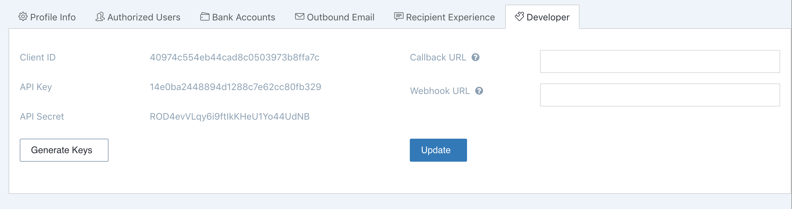

# Checkbook.io Node.js Library

The [Checkbook.io](https://checkbook.io/) Node library provides convenient access to the [Checkbook.io API](https://checkbook.io/docs/api) from
applications written in server-side JavaScript.

## Installation

Install the package with:

    npm install checkbook-api --save
    
## Configuration

The package needs to be configured with your account's API Key and API Secret:

``` js
var CheckbookAPI = require('checkbook-api');
var Checkbook = new CheckbookAPI({
	api_key: 'd6aa2703655f4ba2af2a56202961ca86',
	api_secret: 'dXbCgzYBMibj8ZwuQMd2NXr6rtvjZ8',
	env: 'test'
});
```
    
The ```env``` parameter is optional and can be omitted if the requests are made to the live environment.  
The possible values for this parameter are ```test``` or ```sandbox``` and the API credentials need to be from the specified environment.
    
You can get the API Key and API Secret values from the [Settings](https://checkbook.io/account/settings) page:



## Usage

You can use the following code snippet to send a digital check:

``` js
Checkbook.checks.sendDigitalCheck({
    name: 'Widgets Inc.',
    recipient: 'widgets@example.com',
    description: 'Test Send Check',
    amount: 10.00
}, function (error, response) {
    if (error) {
        console.log('Error:', error);
    } else {
        console.log(response);
    }
});
```

You can use the following code snippet to query the list of checks:

``` js
Checkbook.checks.list({
    page: 2,
    per_page: 10,
    status: 'IN_PROCESS'
}, function (error, response) {
    if (error) {
        console.log('Error:', error);
    } else {
        console.log(response);
    }
});
```

## Methods reference

The ```Checkbook``` class has several endpoints and you can find the detailed reference for the methods each one provide here:

 * [Checkbook.checks](docs/CHECK.md)
 	* [list()](docs/CHECK.md)
 	* [sendDigitalCheck()](docs/CHECK.md)
 * [Checkbook.invoices](docs/INVOICE.md)
 	* [list()](docs/INVOICE.md)
 * [Checkbook.subscriptions](docs/SUBSCRIPTION.md)
 * [Checkbook.banks](docs/BANK.md)
 * [Checkbook.users](docs/USER.md)
 

## Getting help

If you need help installing or using the library, please contact Checkbook.io Support at support@checkbook.io.  

If you've instead found a bug in the library or would like new features added, please open issues or pull requests against this repo.

## More Information

 * [API Endpoints](https://checkbook.io/docs/api#document-api_endpoints)
 * [Error Codes](https://checkbook.io/docs/api#document-error_codes)
 * [Idempotency](https://checkbook.io/docs/api#document-idempotent_requests)
    
    